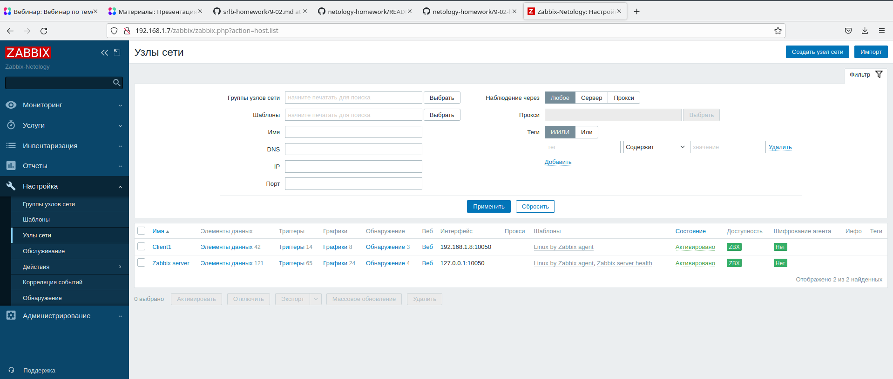

# Домашнее задание к занятию "`9.2 «Система мониторинга Zabbix»`" - "`Гиверц Филипп`"

---

### Задание 1

Установите Zabbix Server с веб-интерфейсом.

Требования к результату:

 1. Прикрепите в файл README.md скриншот авторизации в админке  
 2. Приложите в файл README.md текст использованных команд в GitHub

### Ответ:

 

sudo wget https://repo.zabbix.com/zabbix/6.4/debian/pool/main/z/zabbix-release/zabbix-release_6.4-1+debian11_all.deb

sudo dpkg -i zabbix-release_6.4-1+debian11_all.deb

sudo apt update 

sudo apt install zabbix-server-pgsql zabbix-frontend-php php7.4-pgsql zabbix-nginx-conf zabbix-sql-scripts zabbix-agent2

sudo -u postgres createuser --pwprompt zabbix

sudo -u postgres createdb -O zabbix zabbix 

sudo zcat /usr/share/zabbix-sql-scripts/postgresql/server.sql.gz | sudo -u zabbix psql zabbix

sudo systemctl restart zabbix-server zabbix-agent nginx php7.4-fpm

sudo systemctl enable zabbix-server zabbix-agent nginx php7.4-fpm 

---

### Задание 2

Установите Zabbix Agent на два хоста.

Требования к результату:

 1. Приложите в файл README.md скриншот раздела Configuration > Hosts, где видно, что агенты подключены к серверу.  
 2. Приложите в файл README.md скриншот лога zabbix agent, где видно, что он работает с сервером.  
 3. Приложите в файл README.md скриншот раздела Monitoring > Latest data для обоих хостов, где видны поступающие от агентов данные.  
 4. Приложите в файл README.md текст использованных команд в GitHub.

### Ответ:

 

 

 

sudo wget https://repo.zabbix.com/zabbix/6.4/debian/pool/main/z/zabbix-release/zabbix-release_6.4-1+debian11_all.deb

sudo dpkg -i zabbix-release_6.4-1+debian11_all.deb

sudo apt update 

sudo apt install zabbix-agent2 zabbix-agent2-plugin-*

sudo systemctl restart zabbix-agent2

sudo systemctl enable zabbix-agent2 
